# 🚀 Informe de Mejoras con IA: EduTech Academy

Este documento detalla el proceso de transformación de la aplicación utilizando **Gemini en Android Studio** como consultor senior de UI/UX y arquitectura.

---

## 📸 Estado Inicial (Antes de Gemini)
*Estas capturas representan la base del proyecto desarrollada en la Etapa 1.*

| Login Inicial | Lista de Cursos | Perfil/Progreso |
|:---:|:---:|:---:|
| 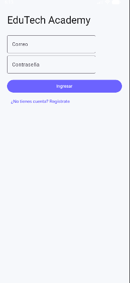 | 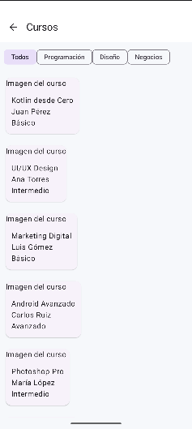 | 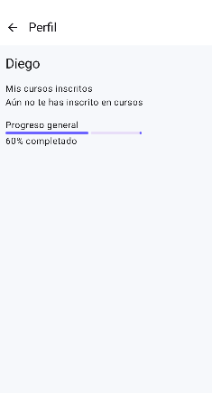 |

---

## ✨ Aplicación de Mejoras con IA (Prompts y Resultados)

### 1. Auditoría de Pantalla de Login
**Prompt usado:**
> "Actúa como diseñador senior de UI/UX especializado en apps móviles con Jetpack Compose. Analiza esta pantalla de login que estoy desarrollando en Kotlin con Material 3. Objetivo: Mejorar la experiencia de usuario y la apariencia visual. Evalúa: Jerarquía visual, espaciado, uso de colores y contraste. Dame: Problemas detectados, recomendaciones y ejemplo de código mejorado."

**Resultado:**
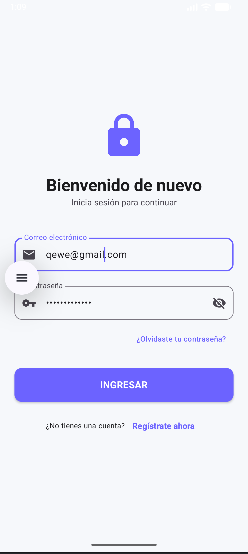

---

### 2. Optimización de Lista de Cursos
**Prompt usado:**
> "Actúa como experto en diseño de interfaces modernas para apps educativas. Analiza esta pantalla de lista de cursos hecha en Jetpack Compose. Objetivo: Hacer que la lista se vea moderna y atractiva. Sugiere: Mejoras visuales usando Material 3, uso de sombras, bordes redondeados y cómo agregar etiquetas como 'Nuevo' o 'Popular'."

**Resultado:**
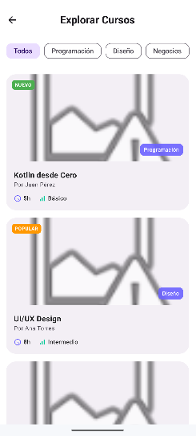

---

### 3. Mejora en Perfil y Visualización de Progreso
**Prompt usado:**
> "Actúa como diseñador UX para aplicaciones educativas. Analiza esta pantalla de perfil o 'Mis cursos' en Jetpack Compose. Objetivo: Mejorar la visualización del progreso del usuario. Sugiere: Mejores barras de progreso, gestión de estados vacíos y mejora visual general."

**Resultado:**
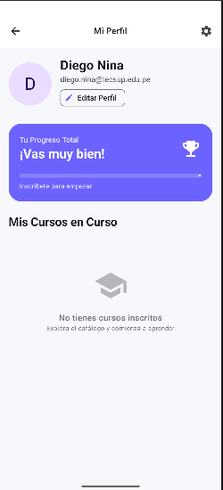

---

### 4. Implementación de Diseño Moderno (Material 3)
**Prompt usado:**
> "En base a las recomendaciones anteriores, genera una versión mejorada del código en Jetpack Compose. Requisitos: Usar Material 3, mejorar tipografía, agregar Cards modernas, bordes redondeados y mejorar botones."

---

### 5. Auditoría de Navegación y Flujo
**Prompt usado:**
> "Actúa como arquitecto senior de UX en aplicaciones Android. Analiza la navegación completa de mi app (Login -> Home -> Cursos -> Detalle -> Perfil). Evalúa: Flujo, uso de botón atrás y redundancias. Dame: Problemas en la arquitectura y propuesta de flujo optimizado con NavHost."

**Resultado:**
*Se optimizó la pila de navegación y se corrigió el comportamiento del botón atrás en pantallas secundarias.*

---

### 6. Gestión de Estados Vacíos y UX Realista
**Prompt usado:**
> "Actúa como experto en UX writing. Mejora los estados vacíos de mi app: No hay cursos inscritos, no hay resultados de búsqueda. Objetivo: Evitar pantallas vacías aburridas. Dame: Textos UX amigables y diseño sugerido con iconos."

**Resultado:**
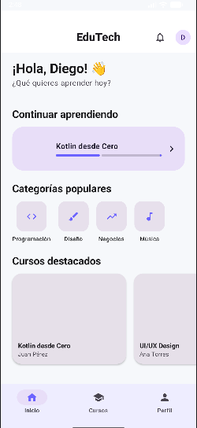

---

### 4. Optimización de Detalle de Curso y Lógica de Inscripción
**Prompt usado:**
> "Actúa como un Desarrollador Senior de Android y experto en UX/UI. Estoy trabajando en la pantalla de 'Detalle del Curso'. Necesito:
> 1. Mejorar la UI con Material 3 (imagen de cabecera, mejor jerarquía y botón destacado).
> 2. Implementar la lógica para que al presionar 'Inscribirse', el curso se agregue a la lista de 'Mis Cursos' en el Perfil.
> 3. Agregar feedback visual (Snackbar) para confirmar la inscripción."

**Resultado:**
| Vista de Detalle | Confirmación (Snackbar) |
|---|---|
| 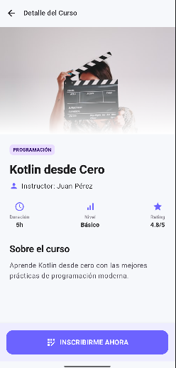 | 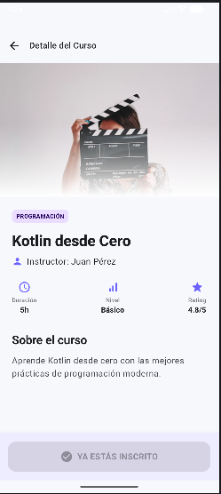 |

---

## 5 y 6. ✨ Implementación de Diseño Moderno y Auditoría de Flujo (Evidencia Total)

### 📱 Galería de Flujo Completo:

| Pantalla | Captura de Pantalla (Diseño Final Material 3) |
| :--- | :--- |
| **1. Login** | 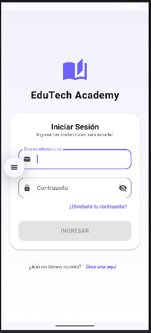 |
| **2. Home (Dashboard)** | 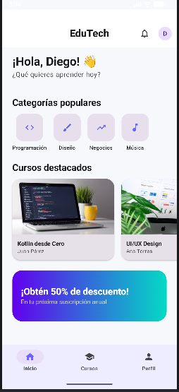 |
| **3. Lista de Cursos** | 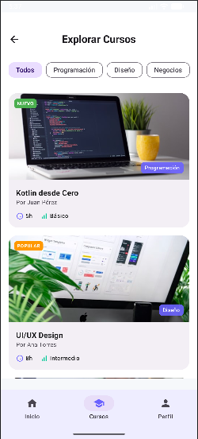 |
| **4. Detalle de Curso** | 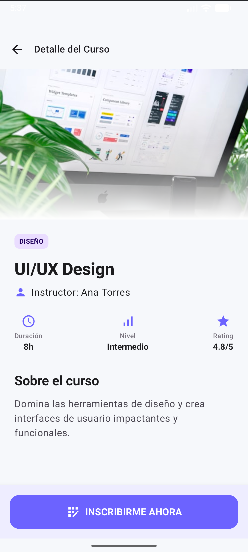 |
| **5. Perfil / Mis Cursos** | 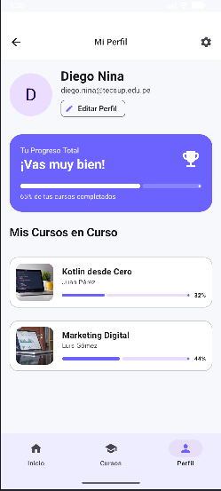 |

---

## 🧠 Reflexión Final
La integración de Gemini permitió transformar un prototipo funcional básico en una aplicación con estándares profesionales de UI/UX. La IA facilitó la implementación de componentes complejos de Material 3 y la optimización de la arquitectura de navegación, logrando un producto final centrado en el usuario y técnicamente sólido.

---
